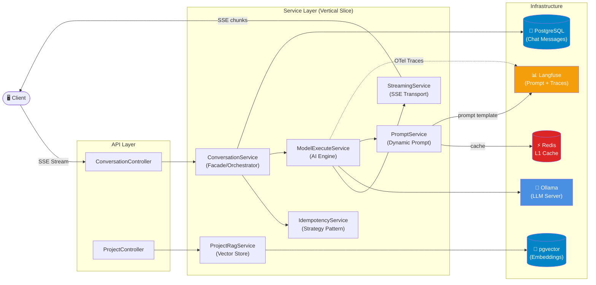
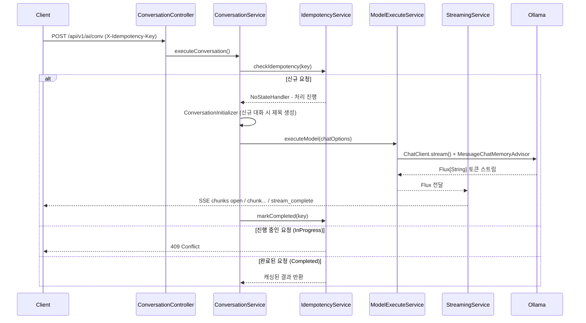

# 🤖 AI Assistant

<div align="center">


**온프레미스 LLM 기반의 개인화 AI 어시스턴트 서비스**

*프로젝트 문서를 업로드하면 AI가 해당 맥락을 이해하고 답변하는 RAG 기반 채팅 플랫폼*

</div>

---

## 📋 목차

- [프로젝트 개요](#-프로젝트-개요)
- [핵심 기능](#-핵심-기능)
- [기술 스택](#-기술-스택)
- [시스템 아키텍처](#-시스템-아키텍처)
- [주요 기술적 의사결정](#-주요-기술적-의사결정-adr)
- [모듈 구조](#-모듈-구조)
- [API 명세](#-api-명세)
- [로컬 실행 방법](#-로컬-실행-방법)

---

## 🎯 프로젝트 개요

AI Assistant는 **온프레미스 Ollama LLM**을 활용한 개인화 AI 채팅 플랫폼입니다.
클라우드 LLM API에 의존하지 않고 자체 서버에서 모델을 운영하며, 사용자가 업로드한 문서를 기반으로 답변하는 **RAG(Retrieval-Augmented Generation)** 기능을 제공합니다.

**핵심 문제의식:** 외부 LLM API는 비용이 높고, 민감한 데이터를 외부로 전송해야 하는 보안 위험이 있습니다. 이를 온프레미스 LLM으로 해결하되, 프로덕션 수준의 신뢰성(Idempotency,
Observability, 스트리밍 복원력)을 갖추는 것을 목표로 설계했습니다.

---

## ✨ 핵심 기능

| 기능                     | 설명                                       |
|------------------------|------------------------------------------|
| 🔄 **실시간 스트리밍**        | SSE(Server-Sent Events) 기반 토큰 단위 실시간 응답  |
| 📚 **Tool-based RAG**  | AI가 필요 시 스스로 문서 검색 도구를 호출하는 에이전트형 RAG    |
| 🛡️ **Idempotency 보장** | Strategy Pattern 기반 멱등성 처리로 중복 AI 요청 방지  |
| 🔭 **AI 추적 관찰**        | OpenTelemetry + Langfuse로 LLM 호출 전 구간 추적 |
| ⚡ **동적 프롬프트**          | 코드 배포 없이 Langfuse에서 런타임 프롬프트 관리          |

---

## 🛠 기술 스택

### Backend Core

| 분류              | 기술                    | 버전            |
|-----------------|-----------------------|---------------|
| Framework       | Spring Boot           | 3.5.9         |
| Language        | Java (Virtual Thread) | 21            |
| AI Framework    | Spring AI             | 1.1.2         |
| LLM Runtime     | Ollama                | -             |
| Embedding Model | qwen3-embedding       | 0.6b (1024차원) |

### Data & Infrastructure

| 분류               | 기술                       | 역할                              |
|------------------|--------------------------|---------------------------------|
| Primary DB       | PostgreSQL               | 채팅 메시지 영구 저장                    |
| Vector DB        | pgvector (HNSW + Cosine) | RAG 임베딩 저장 및 유사도 검색             |
| Cache            | Redis                    | 채팅 메모리 L1 캐시, Idempotency 상태 관리 |
| Document Parsing | Apache Tika + hwplib     | PDF/HWP/HWPX 텍스트 추출             |

### Observability

| 분류                | 기술                   | 역할                 |
|-------------------|----------------------|--------------------|
| Tracing           | OpenTelemetry 2.17.0 | 분산 추적 수집           |
| LLM Observability | Langfuse (OTLP)      | AI 호출 추적 및 프롬프트 관리 |
| Metrics           | Micrometer + OTLP    | 애플리케이션 메트릭         |
| Reactive          | Project Reactor      | 비동기 스트리밍 파이프라인     |

---

## 🏗 시스템 아키텍처



### 요청 흐름 (채팅 요청)



---

## 📐 주요 기술적 의사결정 (ADR)

### ADR-001: Tool-based RAG vs Pipeline RAG

**맥락:** RAG 구현 방식을 선택해야 했습니다. 전통적인 Pipeline RAG는 매 요청마다 벡터 검색을 수행하고 검색 결과를 프롬프트에 무조건 포함합니다.

**결정:** Spring AI `@Tool` 어노테이션을 활용한 **Tool-based RAG** 채택

**근거:**

- AI 모델이 질문의 맥락을 판단하여 문서 검색 도구 호출 여부를 스스로 결정 → 불필요한 검색 감소
- 일반 대화(`PromptType.CONVERSATION`)와 문서 기반 대화(`PromptType.PROJECT`)의 RAG 활성화를 깔끔하게 분리
- `AgentToolProvider`가 요청별 `userId + projectId` 컨텍스트를 생성자 주입으로 `RagTools`에 전달 → ThreadLocal 없이 Virtual Thread 환경에서도 안전한
  컨텍스트 격리

**결과:** 불필요한 벡터 검색 감소 및 에이전트형 AI 동작 구현

---

### ADR-002: Idempotency 처리에 Strategy Pattern 적용

**맥락:** SSE 스트리밍 응답에서 중복 요청을 처리하는 방식이 필요했습니다. Idempotency Key의 상태(없음/진행 중/완료/실패)에 따라 처리 로직이 달라집니다.

**결정:** `IdempotencyStateHandler` 인터페이스 + 4가지 구현체(Strategy Pattern)

```
IdempotencyStateHandler (interface)
├── NoStateHandler        → 신규 처리 시작
├── InProgressStateHandler → 409 Conflict 반환
├── CompletedStateHandler  → 캐싱된 결과 반환
└── FailedStateHandler     → 재처리 허용
```

**근거:**

- 각 상태별 처리 로직을 독립적인 클래스로 캡슐화 → 단일 책임 원칙(SRP)
- 새로운 상태 추가 시 기존 코드 수정 없이 구현체 추가만으로 확장 가능 → 개방/폐쇄 원칙(OCP)
- `StreamingIdempotencyCoordinator`가 상태 판별 후 핸들러에 위임하는 구조로 관심사 분리

---

### ADR-003: 채팅 메모리 이중 저장소 (Redis L1 + PostgreSQL L2)

**맥락:** AI 대화 컨텍스트(이전 메시지)를 효율적으로 제공해야 합니다. 매 요청마다 DB를 조회하면 지연이 발생하고, Redis만 사용하면 서버 재시작 시 메모리가 유실됩니다.

**결정:** Redis를 L1 캐시, PostgreSQL을 L2 영구 저장소로 사용하는 이중 레이어 구조

| 레이어 | 구현체                          | 역할                     |
|-----|------------------------------|------------------------|
| L1  | `RedisChatMemory`            | 빠른 조회 (TTL 기반), 캐시 워밍업 |
| L2  | `CustomChatMemoryRepository` | 영구 저장, 중복 방지 로직 내장     |

**근거:**

- 응답 지연 최소화와 데이터 내구성을 동시에 확보
- Spring AI의 `ChatMemoryRepository` 인터페이스 구현으로 프레임워크 교체 비용 최소화
- `JdbcChatMemoryRepositoryAutoConfiguration` 제외 후 직접 구현하여 비즈니스 로직(중복 방지) 포함

---

### ADR-004: Virtual Thread 전면 활성화

**맥락:** SSE 스트리밍 특성상 다수의 동시 연결이 발생하며, 각 연결은 Ollama 응답을 기다리는 I/O 블로킹 작업을 포함합니다.

**결정:** Java 21 Virtual Thread 전면 활성화 (`spring.threads.virtual.enabled: true`)

**근거:**

- 기존 플랫폼 스레드 풀 방식은 스레드 수 제한으로 동시 SSE 연결에 병목 발생
- Virtual Thread는 I/O 블로킹 시 캐리어 스레드를 해제하여 수천 개의 동시 연결 처리 가능
- SSE 전용 스케줄러(`SseStreamingConfig`)를 별도로 두어 스트리밍 I/O를 메인 스레드 풀과 분리

---

### ADR-005: 동적 프롬프트 관리 (Langfuse + Redis 캐시)

**맥락:** AI 모델의 동작(프롬프트, 파라미터)을 변경할 때마다 코드 배포가 필요하면 운영 유연성이 낮습니다.

**결정:** Langfuse에 프롬프트 템플릿을 저장하고, 런타임에 API로 조회 + Redis 캐시로 성능 최적화

**구조:**

```
Langfuse (프롬프트 저장소)
  → LangfuseClient (REST 호출, 5xx 재시도 내장)
    → PromptService (비즈니스 로직)
      → RedisCacheService (1시간 TTL 캐시)
```

**근거:**

- 코드 배포 없이 temperature, topK, topP, model명, 시스템 프롬프트 변경 가능
- `LangfusePromptTemplate`에 모델 파라미터까지 포함되어 프롬프트와 모델 설정을 일원화 관리
- Langfuse API 장애 시 재시도(max 3회, delay 2초)로 복원력 확보

---

## 📁 모듈 구조

```
src/main/java/com/kade/AIAssistant/
├── agent/                          # AI Tool/Agent 구성
│   ├── provider/AgentToolProvider  # 요청별 컨텍스트 포함 Tool 생성
│   └── tool/RagTools               # @Tool 기반 문서 검색 도구
│
├── common/                         # 공통 모듈 (횡단 관심사)
│   ├── constants/PromptVariables
│   ├── enums/                      # Language, MessageType, PromptType, UserPlan
│   ├── exceptions/                 # BaseException, GlobalExceptionHandler
│   │   └── customs/                # AiModelException, IdempotencyConflictException 등
│   ├── filters/UserIdRequiredFilter
│   ├── prompt/                     # PromptService, PromptTemplateProvider
│   └── utils/                      # StreamingChunkProcessor, ChatResponseMapper
│
├── config/                         # Spring 설정
│   ├── OllamaConfig                # ChatModel 기본 옵션
│   ├── RedisChatMemoryConfig       # Redis 채팅 메모리 빈 등록
│   ├── VectorStoreConfig           # pgvector 커스텀 설정
│   ├── SseStreamingConfig          # SSE 전용 스케줄러
│   └── ObservabilityConfig         # OTel 관찰 필터
│
├── feature/                        # 기능별 Vertical Slice
│   ├── conversation/               # 핵심 AI 채팅
│   │   ├── controller/
│   │   ├── service/
│   │   │   ├── ConversationService     # Facade (오케스트레이터)
│   │   │   ├── ModelExecuteService     # Ollama 호출 엔진
│   │   │   ├── StreamingService        # SSE 전송 레이어
│   │   │   ├── IdempotencyService      # 멱등성 관리
│   │   │   ├── DocumentService         # Tika 문서 파싱
│   │   │   └── idempotency/            # Strategy Pattern 구현체 4종
│   │   ├── entity/
│   │   └── repository/
│   ├── project/                    # RAG 프로젝트 (문서 업로드)
│   ├── preference/                 # 사용자 설정
│   ├── login/                      # 인증
│   └── statistic/                  # Langfuse 통계 조회
│
└── infra/                          # 외부 시스템 연동
    ├── langfuse/
    │   ├── observability/           # BaggageSpanProcessor, UserTrackingFilter
    │   └── prompt/                  # LangfuseClient, LangfusePromptTemplate
    ├── ollama/factory/             # OllamaChatModelFactory (@Cacheable)
    └── redis/
        ├── context/                 # RedisChatMemory, CustomChatMemoryRepository
        └── prompt/RedisCacheService
```

---

## 📡 API 명세

### 인증

| Method | Endpoint             | 설명  |
|--------|----------------------|-----|
| `POST` | `/api/v1/auth/login` | 로그인 |

### 대화 (Conversation)

| Method   | Endpoint                                    | 설명            | 비고                               |
|----------|---------------------------------------------|---------------|----------------------------------|
| `POST`   | `/api/v1/ai/conv`                           | AI 채팅 (일반)    | SSE 스트리밍, `X-Idempotency-Key` 헤더 |
| `POST`   | `/api/v1/ai/conv/file`                      | AI 채팅 (파일 첨부) | Multipart, PDF/HWP/HWPX 지원       |
| `GET`    | `/api/v1/ai/conv`                           | 대화 목록 조회      | 페이지네이션                           |
| `GET`    | `/api/v1/ai/conv/{conversationId}`          | 대화 상세 조회      |                                  |
| `GET`    | `/api/v1/ai/conv/{conversationId}/messages` | 메시지 목록 조회     |                                  |
| `PATCH`  | `/api/v1/ai/conv/{conversationId}`          | 대화 제목 수정      |                                  |
| `DELETE` | `/api/v1/ai/conv/{conversationId}`          | 대화 삭제         |                                  |

### SSE 이벤트 타입

```
open           → 스트리밍 시작 (conversationId 포함)
chunk          → AI 응답 토큰 (OpenAI 호환 ChatCompletionChunk 형식)
stream_complete → 스트리밍 완료
error          → 오류 발생
```

### RAG 프로젝트

| Method   | Endpoint                                   | 설명              |
|----------|--------------------------------------------|-----------------|
| `POST`   | `/api/v1/ai/proj`                          | 프로젝트 생성         |
| `GET`    | `/api/v1/ai/proj`                          | 프로젝트 목록 조회      |
| `GET`    | `/api/v1/ai/proj/{projectId}`              | 프로젝트 상세 조회      |
| `DELETE` | `/api/v1/ai/proj/{projectId}`              | 프로젝트 삭제         |
| `POST`   | `/api/v1/ai/proj/{projectId}/docs`         | 문서 업로드 (벡터 임베딩) |
| `GET`    | `/api/v1/ai/proj/{projectId}/docs`         | 문서 목록 조회        |
| `DELETE` | `/api/v1/ai/proj/{projectId}/docs/{docId}` | 문서 삭제           |

### 설정 및 통계

| Method  | Endpoint          | 설명                                           |
|---------|-------------------|----------------------------------------------|
| `GET`   | `/api/v1/ai/pref` | 사용자 선호도 조회                                   |
| `PATCH` | `/api/v1/ai/pref` | 사용자 선호도 수정 (nickname, occupation, extraInfo) |
| `GET`   | `/api/v1/ai/stat` | Langfuse 관찰 통계 조회                            |

---

## 🚀 로컬 실행 방법

### 필수 요구사항

- Java 21+
- Docker & Docker Compose
- Ollama 서버 (로컬 또는 원격)
- Langfuse 계정 (프롬프트 관리용)

### 환경 변수 설정

```bash
export DB_USERNAME=postgres
export DB_PASSWORD=postgres
export LANGFUSE_PUBLIC_KEY=pk-lf-...
export LANGFUSE_SECRET_KEY=sk-lf-...
```

### 인프라 실행 (Docker)

```bash
# PostgreSQL (pgvector 확장 포함)
docker run -d \
  --name postgres-ai \
  -e POSTGRES_DB=aichat \
  -e POSTGRES_USER=postgres \
  -e POSTGRES_PASSWORD=postgres \
  -p 54321:5432 \
  pgvector/pgvector:pg16

# Redis
docker run -d \
  --name redis-ai \
  -p 6389:6379 \
  redis:7-alpine
```

### 애플리케이션 실행

```bash
# 빌드
./gradlew build

# 실행
./gradlew bootRun

# 또는 JAR 실행
java -jar build/libs/AIAssistant-0.0.1-SNAPSHOT.jar
```

### Ollama 모델 준비

```bash
# 채팅 모델
ollama pull qwen3:4b

# 임베딩 모델
ollama pull qwen3-embedding:0.6b
```

---

## 📈 성능 및 운영 특성

| 항목              | 설정값                      | 설명                     |
|-----------------|--------------------------|------------------------|
| SSE 타임아웃        | 20분                      | _테스트 개발 하드웨어 성능 이슈_    |
| 스트리밍 재시도        | 최대 3회 (100ms~2000ms 백오프) | Ollama 일시적 장애 복원       |
| Idempotency TTL | 24시간                     | 중복 요청 방지 유효 기간         |
| 컨텍스트 메시지 수      | 20개                      | AI에 전달되는 이전 대화 수       |
| 트레이싱 샘플링        | 100%                     | 모든 요청 추적 (운영 환경 조절 필요) |
| 프롬프트 캐시 TTL     | 1시간                      | Langfuse API 호출 최소화    |

---

<div align="center">

Made with ☕ and Spring Boot

</div>
